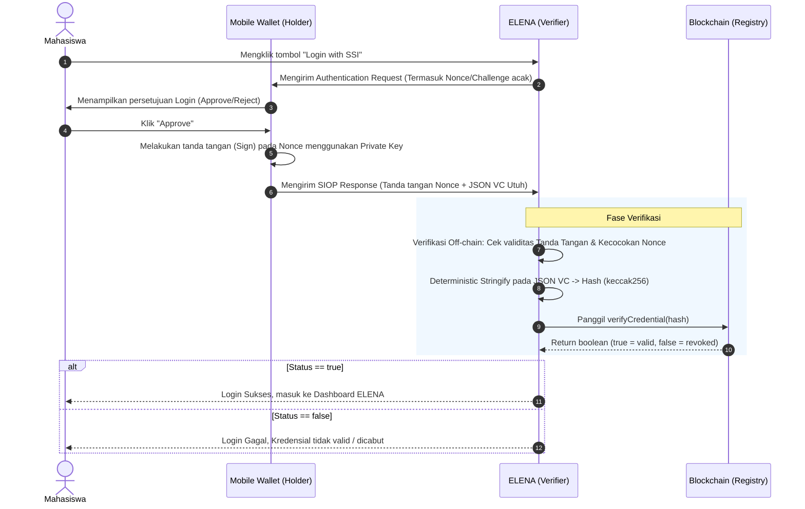

# Alur Autentikasi SIOPv2 (Single Sign-On)
Dokumen ini menjelaskan urutan interaksi (*sequence*) antara Mobile Wallet mahasiswa dan Sistem ELENA untuk melakukan Login Tanpa Password (SSO).

## Sequence Diagram

